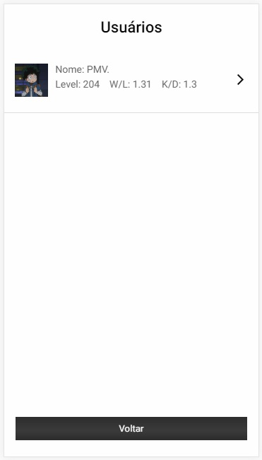
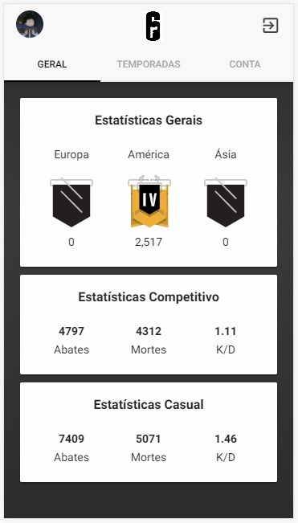

# R6 Status app

Aplicativo criado com ionic 3 ultilizando requisições de uma API externa para obtenção de estatísticas pessoais no jogo Rainbow Six Siege.

## Como executar o projeto

Clone o projeto e após isso execute os seguintes comandos:

- npm install / npm i
- ionic serve (para ultilizar a visualização web).
- ionic cordova run android (para execução em um emulador ou aparelho android).

## Screenshots

